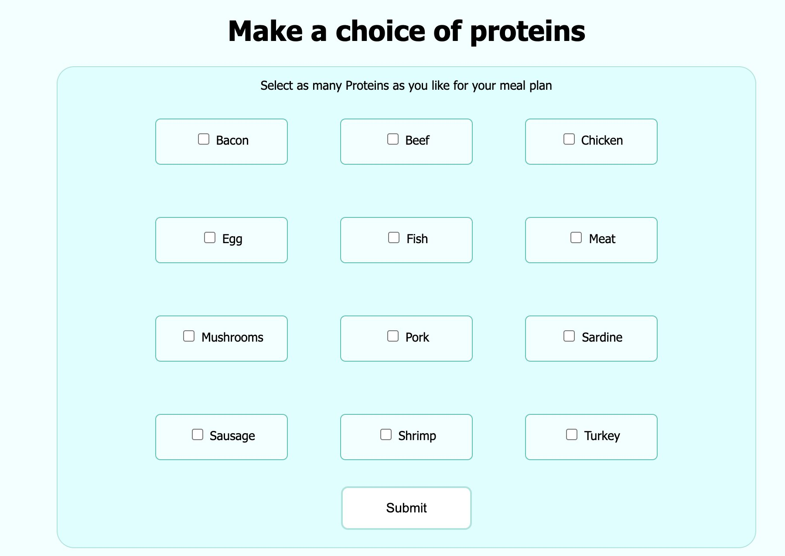
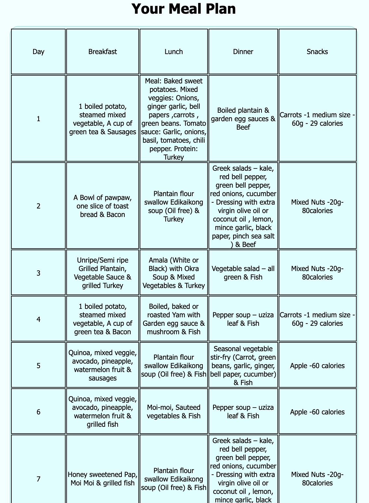
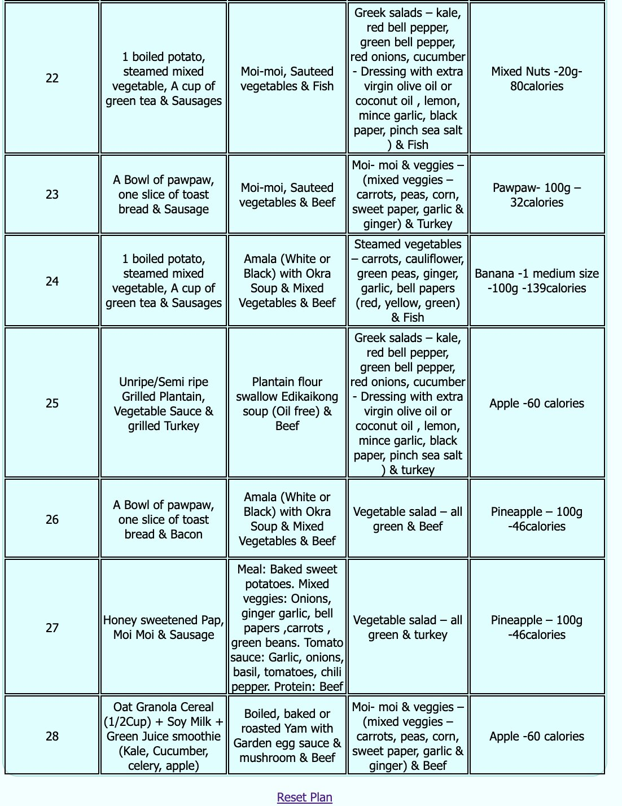
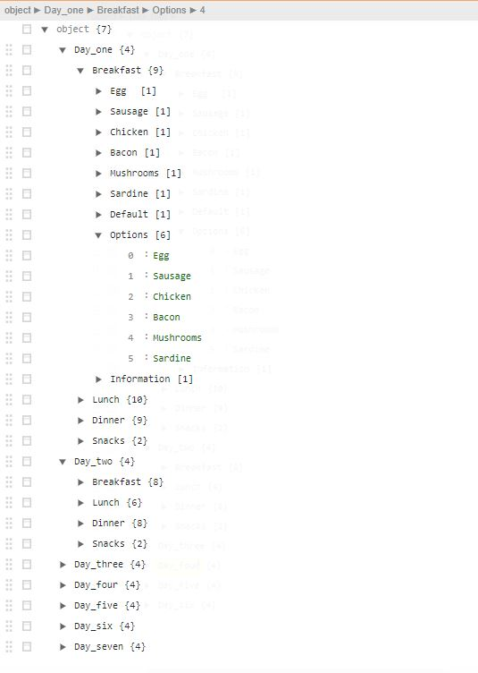
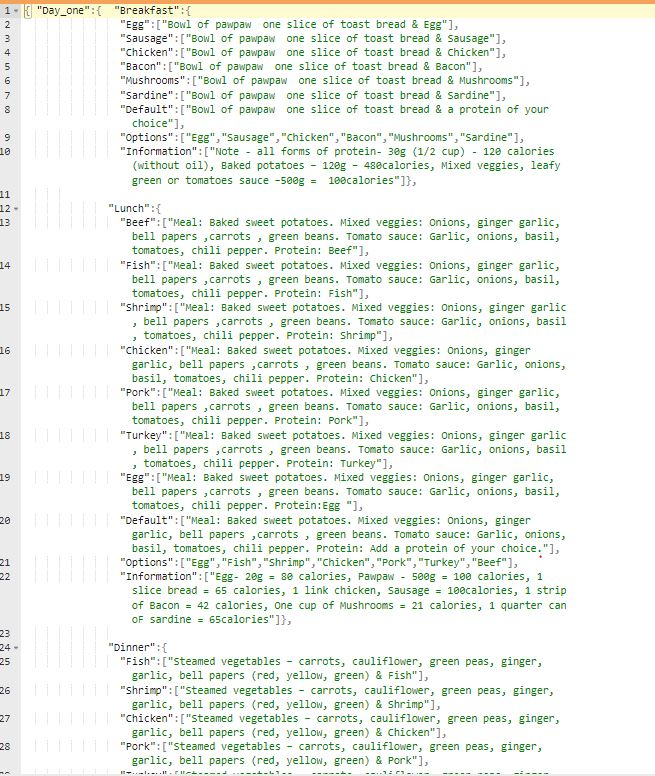

# Meal Planning Algorithm

This repository contains files for a crafting a weekly meal plan from a predifined meal and an algorithm for randomized meal planning algorithm. This was creted for a  health and planning application. It contains scripts and notebooks for explanation as well as a small flask application to see the algorithm. 

---

## Table Of Contents
 - [Project Structure](#project-structure)
 - [Process Descriptions](#process-descriptions)
 - [Instructions On Running The Project](#instructions-on-running-the-project)
 - [Dataset](#dataset)

## Project Structure
Meal Plan Main Folder
   |--app  
   |   |--run.py  #main flask file  
   |   |--mealplan.py #meal plan creation script  
   |   | 
   |   |--templates  
   |   |    |--master.html #home html page  
   |   |    |--go.html #message result response html page  
   |   | 
   |   |--data  
   |   |    |--meal_plan.json #json data file containing meals  
   |   | 
   |   |--static #style files for the application  
   |   |   |--css   
   |   |   |    |--home.css  
   |   |   |    |--plan.css  
   |   | 
   |  
   |--requirements.txt 
   |  
   |--images #store for readme images  
   |  
   |--README.md  
   |--requirements.txt

## Process Descriptions
The project can be separted into three sections, each with their contributions to the application.

1. **ETL Pipeline**
A Python script, `mealplan.py`, containing function that run a data cleaning pipeline to process the meals:

 - Loads the meal plan data
 - Creates a randomized daily plan
 - Returns the plan

2. **Flask Web Application**
A flask web app visualizes the created meal plan and provides a simple interface where workers can users can input their preferences and get a randomized meal plan. Images below:

## Instructions On Running The Project
1. Run the following command in the **flaskapp** directory to run the web app.
    `python3 -m flask run`

2. Go to http://172.0.0.1:5000/ on your local machine to access web app.

## Dataset:
Our data consists of individual meal plans with breakfast, lunch, dinner and brunch created for a generalized meal plan by a dietican. This data spans over 7 days of meals.

The meal plan data belongs to Choose Life.
